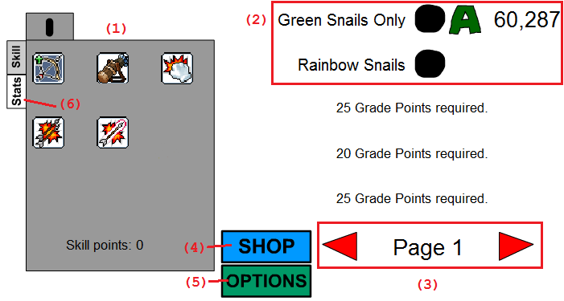

---

layout: ./_mdx_layout.astro
title: Hunterstory Guide

---

<b>Table of Contents</b>
<ol>
<li><a href="#basics">Some Basics of Hunterstory</a></li>
<li><a href="#noob">Part One: Noob</a></li>
<li><a href="#midgame">Part Two: Midgame</a></li>
<li><a href="#grinding">Part Three: Grinding</a></li>
<li><a href="#ascendance">Part Four: Ascendance</a></li>
<li><a href="#ascending">Ascending</a></li>
</ol>

<h2><u>Some Basics of Hunterstory</u></h2>
A few terms you will need to know:  
<table border="1" bordercolor="#888" cellspacing="0" style="border-width:1px;border-color:rgb(136,136,136);border-collapse:collapse">
<tbody>
<tr>
<td>&nbsp;<strong>Term</strong></td>
<td>&nbsp;<strong>Meaning</strong></td>
</tr>
<tr>
<td>&nbsp;Mission</td>
<td>&nbsp;A "level" in Hunterstory.</td>
</tr>
<tr>
<td>&nbsp;Mesos</td>
<td>&nbsp;The currency of Hunterstory.</td>
</tr>
<tr>
<td>&nbsp;Points</td>
<td>&nbsp;Obtained when you complete a mission.</td>
</tr>
<tr>
<td>&nbsp;Rank</td>
<td>&nbsp;Determined from your score on a mission.</td>
</tr>
<tr>
<td>&nbsp;Grade Point</td>
<td>&nbsp;Required to unlock better missions, with stronger monsters.</td>
</tr>
<tr>
<td>&nbsp;Rush (mission)</td>
<td>&nbsp;A special type of mission where monsters spawn much faster than usual. Marked with red text.</td>
</tr>
<tr>
<td>&nbsp;Boss (mission)</td>
<td>&nbsp;A special type of mission where&nbsp;a boss monster is spawned over the regular monsters. Marked with blue text.</td>
</tr>
<tr>
<td>&nbsp;Ascent</td>
<td>&nbsp;A "rerun" of the game, where the player is set back to Level 1 with some perks.</td>
</tr>
</tbody>
</table>
  
A picture is worth a thousand words:  
<strong><u>Main Screen</u></strong>  
  
1. This is the Skill Box, which contains all your skills.  
2. These are the missions. Displayed is the mission name, rank, and points gained from the mission, respectively. Click the black blotch to start the mission.  
3. Navigates the pages of missions contained in the game.  
4. The Shop: buy stronger bows and other various stuff.  
5. Options: Lets you set keys to use active skills, and some other things.  
6. Stats: Displays Level, EXP, Damage, etc.   
  
<strong><u>Battle Screen</u></strong>  
  
<strong>Click and hold&nbsp;to shoot an arrow. The position of your mouse determines where the arrow will go.</strong>  
<strong>The closer the mouse is to your character, the higher it will go.</strong>  
1. Level/EXP bar. Displays current level and EXP.  
2. Number of monsters you need to kill in order to finish the mission.  
3. Number of points you have gained from the mission.  
4. The type of arrows you have, and how many left.  
5. Your currently selected skill.  
6. MP bar. Using skills costs MP, so watch this bar.  
7. The death line: don't let the monsters cross here.  
8. The repel line: this will be pushed closer towards you as monsters get closer. It comes back to the blue triangle slowly.  
9. The starting line: the repel line starts here at the beginning of a mission.  

---

This is the full guide to training! I split training into 4 parts:  
Noob  
Midgame  
Grinding  
Ascendance  
Have fun reading my training guide!

---

<h3><a id="noob">Part One: Noob</a></h3>
<em>This part will get you used to the game's controls.</em>  
&nbsp;  
Welcome to Hunterstory! When you start,&nbsp;you&nbsp;will see only one&nbsp;mission, <strong>Green Snails Only</strong>.  
Finish that mission, and then finish the mission that you unlock text, <strong>Rainbow Snails</strong>.  
Keep doing these two missions until you get&nbsp;A ranks on both. Don't lose faith! This honestly is the hardest part of the game.  
&nbsp;  
After that, you will unlock&nbsp;<strong>Shroom &amp; Friend</strong>, then <strong>Shroom &amp; Big Friend</strong> and <strong>Red Snerg Rush</strong>.  
At the minimum, get a C on <strong>Shroom &amp; Friend</strong> and <strong>Shroom &amp; Big Friend</strong>, and a D on <strong>Red Snerg Rush</strong>.  

---

<strong>Door of Accomplishment 1</strong>  
Green Snails Only - A  
Rainbow Snails - A  
Red Snerg Rush - D  
Shroom &amp; Friend - C  
Shroom &amp; Big Friend - C  
33 GP

---

Move on to Page 2. Finish the mission <strong>Trouble Bubbling</strong> &amp; <strong>Logger's Nightmare, </strong>and get a B on both ;missions.  
Then, train at <strong>Double Bubble Trouble</strong>, while occasionally trying to get a C rank on <strong>Slithers &amp; Spikes</strong> and <strong>Fungi Force</strong>.  
  
Go back to Page 1 and:  
B rank on <strong>Shroom &amp; Friend</strong> and <strong>Shroom &amp; Big Friend</strong>.  
... which will give you 6 GP.  

---

<strong>Door of Accomplishment 2</strong>  
Page 1&nbsp;- A/A/D/B/B  
Trouble Bubbling - B  
Logger's Nightmare - B  
Double Bubble Trouble - D  
Slithers &amp; Spikes - C  
Fungi Force - C  
68 GP

---

Move on to Page 3.&nbsp;Get a B on <strong>Land of Wild Boar I</strong> and <strong>Land of Wild Boar II</strong>.  
Train at the newly unlocked <strong>Leporidae Marching Band</strong>, and get a B rank on <strong>Land of Wild Boar III </strong>once you unlock it.  

---

<strong>Door of Accomplishment 3</strong>  
Page 1 - A/A/D/B/B  
Page 2 - B/B/D/C/C  
Land of Wild Boar I - B  
Land of Wild Boar II - B  
Land of Wild Boar III - B  
Leporidae Marching Band - B  
100 GP

---

Move on to Page 4. Get a B rank on <strong>Pixies &amp; Faeries</strong> and a C rank on <strong>Lorang Lorang</strong>  
There's a new mission on Page 3, the boss mission <strong>March of the Slime King</strong>. Get a D rank on it.  
<i>The easy way to complete a boss mission is to aim for the lower part of the boss, so you can take down the boss and the boss's grunts without moving your mouse.</i>  
After you've done that, B rank the other two missions on Page 4, <strong>Chronos Platoon</strong> and <strong>Pixies Part II</strong>.  

---

<strong>Portal to Midgame</strong>  
Page 1 - A/A/D/B/B  
Page 2 - B/B/D/C/C  
Page 3 - ../B/B/B/B  
March of the Slime King - D  
Pixies &amp; Faeries - B  
Lorang Lorang - B  
Chronos Platoon - B  
Pixies Part II - B  
135 GP  

---

<h3>Second Part: Midgame</h3>

<em>This part will cover the less grindy part of the game, after you have gotten the hang of the controls.</em>  
  
Now, you need 15 GP to unlock each subsequent mission, instead of the 7 or 8GP before.  
That means we will have to go back to previous missions and get better ranks on them :)  
  
We need 43 GP to unlock the first mission on Page 6. So, let's raise some ranks:  

Go back to Page 1-2 and:  
- B rank <strong>Red Snerg Rush</strong>  
- A rank <strong>Shroom &amp; Friend</strong> and <strong>Shroom &amp; Big Friend</strong>  
- A rank <strong>Double Bubble Trouble</strong>  
- B rank <strong>Slithers &amp; Spikes</strong>  
- A rank <strong>Fungi Force</strong>  
  
... which will give us an extra 22 GP.  
  
Now we complete each mission in order on Page 5. Get a B rank on <strong>Chronos Brigade</strong>, <strong>Welcome to Omega Sector</strong>, and <strong>Cybernetic Defense Squad</strong>.

---

<strong>Door of Skill 1</strong>  
Page 1 - A/A/B/A/A  
Page 2 - B/B/A/B/A  
Page 3 - B/B/B/B/B  
Page 4 - B/C/../B/B  
Chronos Brigade - B  
Welcome to Omega Sector - B  
Cybernetic Defense Squad - B  
185 GP

---

Now we need 80 GP for Page 7. Let's set a smaller goal: 40 GP. This will give the first of the two locked missions on Page 5, which can be easily done to get the second locked mission.  
  
Go to Page 4, and get a C on <strong>Trojan War</strong>.  
  

Go back to Page 2-3 and:  
- A rank <strong>Trouble Bubbling </strong> and <strong>Logger's Nightmare</strong>  
- A rank all of Page 3  
  
... which will give us 14 GP.  
&nbsp;  
Now, only 21 GP is needed. Get a B or higher on <strong>Dangerous Valley</strong>, <strong>Watch Out for Icy Path</strong>, and <strong>Defeat Kittens</strong>.  
&nbsp;  
We have both <strong>Cold Field</strong> and <strong>Chief Gray</strong> unlocked! Get an A on&nbsp;<strong>Cold Field</strong> and a C on <strong>Chief Gray </strong>to unlock <strong>Star, Sun &amp; Moon</strong>. B-rank that to unlock <strong>Defeat Monsters</strong>, which you should C-rank.  
&nbsp;  
All we need now is 9 GP! Getting an A on everything but <strong>Trojan War</strong> on Page 4 will give us that.  

---

<strong>Door of Skill 2</strong>  
Page 1 - A/A/B/A/A  
Page 2 - A/A/A/B/A  
Page 3 - A/A/A/A/A  
Page 4 - A/A/../A/A  
Page 5 - B/B/B/../..  
Trojan War - C  
Dangerous Valley - B  
Watch Out for Icy Path - B  
Defeat Kittens - B  
Cold Field - A  
Chief Gray - C  
Star, Sun &amp; Moon - B  
Defeat Monsters - C  
267 GP  

---

Finally, your first easy mission page! There are two boss missions and one rush mission on this page.  
Get an A on <b>Forest of Dead Trees</b>&nbsp;and then <b>Dangerous Valley II</b>, and you're done!  

---

<b>Door of Skill 3</b>  
Page 1 - A/A/B/A/A  
Page 2 - A/A/A/B/A  
Page 3 - A/A/A/A/A  
Page 4 - A/A/C/A/A  
Page 5 - B/B/B/C/C  
Page 6 - B/B/B/A/B  
Forest of Dead Trees - A  
Dangerous Valley II - A  
287 GP  

---

Let's do some AA'ing now! If you didn't know, HunterStory has ranks past A: AA, AAA, and S.  
  
Get these ranks:  

- AAs on Page 1 except <b>Green Snails Only</b> and <b>Rainbow Snails</b>.  
- AAs on all of Page 2-3  
- AAs on the non-boss missions of Page 4  
- B <b>Trojan War</b>
  
...which will give 41 GP.  
  
We can easy pass Page 8 now. Get Bs on <b>Drake's Meal Table</b>, <b>The Crown-Flyer</b>, and <b>Yeti &amp; Son</b> to unlock <b>Fire &amp; Ice</b>,&nbsp;and get a B on&nbsp;<b>Fire &amp; Ice</b>&nbsp;to unlock the mission on the next page.  

---

<b>Door of Skill 4</b>  

Page 1 - A/A/AA/AA/AA  
Page 2 - AA/AA/AA/AA/AA  
Page 3 - AA/AA/AA/AA/AA  
Page 4 - AA/AA/B/AA/AA  
Page 5 - B/B/B/C/C  
Page 6 - B/B/B/A/B  
Page 7 - A/../../A/..  
Drake's Meal Table - B  
The Crown-Flyer - B  
Yeti &amp; Son - B  
Fire &amp; Ice - B  
360 GP  

---

Onwards to Page 9! We are aiming for 398 GP to unlock the next mission on Page 10, which means we need to scrounge up 36 GP from somewhere.  
  
Let's continue AA'ing the rest of the missions, and improving some boss mission ranks.  

- AA-rank the non-boss missions on Page 5-6  
- A rank <b>Trojan War</b>  
- A rank <b>Chief Gray</b>
  
... which will give you 37 GP.  
  
We now have enough GP to progress to the next page. B-rank <b>Wild Kargo's Area</b>,&nbsp;<b>Excavation Site</b>, and the newly unlocked&nbsp;<b>Room of Courage</b>.  

---

<b>The Portal to Grinding</b>  
Page 1 - A/A/AA/AA/AA  
Page 2 - AA/AA/AA/AA/AA  
Page 3 - AA/AA/AA/AA/AA  
Page 4 - AA/AA/A/AA/AA  
Page 5 - AA/AA/AA/A/C  
Page 6 - AA/AA/AA/AA/AA  
Page 7 - A/../../A/..  
Page 8 - B/B/B/../B  
Wild Kargo's Area - B  
Excavation Site - B  
Room of Courage - B  
421 GP

---

<h3>Third Test: Grinding</h3>
<em>This part will cover the more grindy part of the game.</em>  
  
Before you start with Page 10,&nbsp;continue with AAing every previous mission.  
- AA-rank <b>Forest of Dead Trees</b>, <b>Forest of Dead You</b>, and <b>Dangerous Valley II</b> on Page 7  
... which will give you 16 GP.  
  
Get something else to do while you grind. This will take some time.  
  
Train at <b>Sanctuary Entrance I</b>&nbsp;until you can easily AA rank it. Then, move to <b>Wolf Territory I</b>, <b>Cave of Trial I</b>, and&nbsp;<b>Sanctuary Entrance II</b>, and AA rank those missions too.  
  
The AAs in these missions and the ones after are the easiest AAs you will ever get, since the monsters cover the entire width of the screen, so you will never miss if you're trying to hit them.  

---

<b>Door of Strength 1</b>  
Page 1 - A/A/AA/AA/AA  
Page 2 - AA/AA/AA/AA/AA  
Page 3 - AA/AA/AA/AA/AA  
Page 4 - AA/AA/A/AA/AA  
Page 5 - AA/AA/AA/A/C  
Page 6 - AA/AA/AA/AA/AA  
Page 7 - AA/AA/../AA/..  
Page 8 - B/B/B/../B  
Page 9 - B/../B/B/..  
Sanctuary Entrance I - AA  
Wolf Territory I - AA  
Cave of Trial I - AA  
Sanctuary Entrance II - AA  
491 GP

---

Move on to Page 11. We have only one mission: <b>Garden of Darkness</b>. Get an A rank that mission. It is a little tough, since the monsters are so small, but you'll get it.  
  
Now you've unlocked the next mission, <b>R.C.M.P.</b>This is a big jump in difficulty from<b>&nbsp;Sanctuary Entrance II</b>, so you will have to grind a lot more here than on Page 10. AA rank this mission.  
  
Now you are 17 GP short of Page 12. You can get this by:  

- AA'ing <b>Drake's Meal Table</b> on Page 8  
- AA'ing <b>Fire &amp; Ice</b> on Page 8
  
... which will give you 6 GP.  
  
Now we have unlocked <b>Warped Path of Time</b>; get an AA on that mission to reach Page 12.  

---

<b>Door of Strength 2</b>  
Page 1 - A/A/AA/AA/AA  
Page 2 - AA/AA/AA/AA/AA  
Page 3 - AA/AA/AA/AA/AA  
Page 4 - AA/AA/A/AA/AA  
Page 5 - AA/AA/AA/A/C  
Page 6 - AA/AA/AA/AA/AA  
Page 7 - AA/AA/../AA/..  
Page 8 - AA/B/B/../AA  
Page 9 - B/../B/B/..  
Page 10 - AA/../AA/AA/AA  
Garden of Darkness - A  
R.C.M.P. - AA  
Warped Path of Time - AA  
533 GP

---

Page 12 is a very easy page to get through. But before we go knocking down each mission, we need some GP. There are still some leftover boss missions on Page 4 and Page 5 which don't have an AA rank yet, so we can scrounge some GP from them:  
- AA rank <b>Trojan War</b> on Page 4  
- AA rank&nbsp;<b>Chief Gray</b>&nbsp;and <b>Defeat Monsters</b>&nbsp;on Page 5  
... which will give you 11 GP.  
  
Now, just complete each mission of Page 12 in order and you're done with Page 12! You might need to go back to <b>R.C.M.P.</b>&nbsp;on Page 11 to grind more levels.  

---

<b>Portal to Ascendance</b>  
Page 1 - A/A/AA/AA/AA  
Page 2 - AA/AA/AA/AA/AA  
Page 3 - AA/AA/AA/AA/AA  
Page 4 - AA/AA/AA/AA/AA  
Page 5 - AA/AA/AA/AA/AA  
Page 6 - AA/AA/AA/AA/AA  
Page 7 - AA/AA/../AA/..  
Page 8 - AA/B/B/../AA  
Page 9 - B/../B/B/..  
Page 10 - AA/../AA/AA/AA  
Page 11 - ../A/../AA/AA  
Warped Path of Time II - AA  
Unbalanced Time - AA  
Forgotten Path of Time - AA  
Forgotten Path of Time II - AA  
Lost Time - AA  
604 GP  

---

<h3>Fourth Test: Ascendance</h3>
<i>This part will cover the area past 4th job and into ascendance.</i>  
  
There are a lot of blanks and under-ranked missions around Pages 7 to 9, so let's fill in those.  

- Get a B rank on <b>A Crack in The Wall</b> and <b>Somebody Else's House</b> on Page 7.  
- Get an A rank on <b>The Crown Flyer</b> and <b>Yeti &amp; Son</b> on Page 8.  
- Get an A rank on <b>Yeti &amp; Dad</b> on Page 8.  
- Get an AA rank on <b>Wild Kargo's Area</b>, <b>Excavation Site</b>, and <b>Room of Courage</b> on Page 9.  
- Get an A rank on <b>Grave of Mushmom</b> on Page 9.
  
... which will give you 52 GP.  
  
Now you can AA rank all the normal missions on Page 13, and get at least a B rank on <b>Cave of Trial III</b>.&nbsp;  

---

<b>Path of Ascendance 1</b>  
Page 1 - A/A/AA/AA/AA  
Page 2 - AA/AA/AA/AA/AA  
Page 3 - AA/AA/AA/AA/AA  
Page 4 - AA/AA/AA/AA/AA  
Page 5 - AA/AA/AA/AA/AA  
Page 6 - AA/AA/AA/AA/AA  
Page 7 - AA/AA/B/AA/B  
Page 8 - AA/A/A/A/AA  
Page 9 - AA/A/AA/AA/..  
Page 10 - AA/../AA/AA/AA  
Page 11 - ../A/../AA/AA  
Page 12 - AA/AA/AA/AA/AA  
Cave of Trial II - AA  
Cave of Trial III - B  
Leafre Stampede - AA  
Terrapin Trouble - AA  
Terrapin Trouble II - AA  
712 GP  

---

For Page 14, you can just AA rank the missions in subsequent order, since you obtained all that GP before.  
  
This page is where the game gets somewhat grindy again, but it won't be as bad as Wolf Territory to R.C.M.P.  

---

<b>Path of Ascendance 2</b>  
Page 1 - A/A/AA/AA/AA  
Page 2 - AA/AA/AA/AA/AA  
Page 3 - AA/AA/AA/AA/AA  
Page 4 - AA/AA/AA/AA/AA  
Page 5 - AA/AA/AA/AA/AA  
Page 6 - AA/AA/AA/AA/AA  
Page 7 - AA/AA/B/AA/B  
Page 8 - AA/A/A/A/AA  
Page 9 - AA/A/AA/AA/..  
Page 10 - AA/../AA/AA/AA  
Page 11 - ../A/../AA/AA  
Page 12 - AA/AA/AA/AA/AA  
Page 13 - AA/AA/AA/AA/AA  
Dangerous Sea Gorge - AA  
Leafre Safari - AA  
Forbidden Time - AA  
Jaws - AA  
760 GP  

---

There are a lot of incomplete missions (mostly bosses) on Pages 9 to 11, so that can be some easy GP:  

- AA rank Wiseman's Fountain on Page 9  
- AA rank <b>Wolf Territory II</b> on Page 10  
- AA rank <b>Cursed Sanctuary</b> and A rank <b>Running With The Devil</b> on Page 11.
  
... which will give you 46 GP.  
  
Now, you can get an extra 36 GP from <b>Cornian Battle Troupe</b>, <b>Cornian Elite Squad</b>, and <b>Warped Passage</b>.  
  
This is where I will stop going in depth for what to do. From here, you will have to start AAA or S ranking missions to get any farther.  
  
<i>The first step to S rank a mission is to never miss, and to always keep the monsters behind the blue triangle. This can give you an easy x10 multiplier on your mission score.</i>  
<i>If the first step does not work (as with most missions before Page 7), then there is a specific way to fire which will spike your score. At each mission, move your mouse cursor around the second "0" of the "Power: 100%" text on the left of the Battle Screen, and fire from there. It will take some time to get used to, but it will help greatly.</i>  
  
For your convenience: to get <b>Balrog Family Reunion</b>&nbsp;on Page 16, you will need 900 total GP, and even more for&nbsp;<b>HermitStory</b>&nbsp;(925) and&nbsp;<b>Athena Pierce&nbsp;</b>(950).  
  
Here is a list of relatively easy missions to start AAA or S ranking.  
  
<b>Page 1:</b>&nbsp;<b>N/A</b> (this is possibly the hardest page to fully S rank in the game)  
<b>Page 2:</b>&nbsp;<b>Logger's Nightmare</b>,&nbsp;<b>Double Bubble Trouble</b>&nbsp;  
<b>Page 3: Land of Wild Boar, Land of Wild Boar II, Land of Wild Boar III</b>  
<b>Page 4: Lorang Lorang, Chronos Platoon, Pixies Part II</b>  
<b>Page 5: Chronos Brigade, Cybernetic Defense Squad</b>  
<b>Page 6: Everything</b>  
<b>Page 7: Forest of Dead Trees, Forest of Dead You, Dangerous Valley II</b>  
<b>Page 8: Drake's Meal Table, Fire &amp; Ice</b>  
<b>Page 9: Everything</b>  
<b>Page 10: Everything</b>  
<b>Page 11: Cursed Sanctuary, R.C.M.P., Warped Path of Time</b>  
<b>Page 12: Everything</b>  
<b>Page 13: Everything</b>  
<b>Page 14: Everything</b>  
<b>Page 15: Everything</b>  
<b>Page 16: Balrog Family Reunion, The Call of Zakum</b>  
  
Right now, your main goal is to get 100,000,000 mesos as fast as you can, and then achieving Level 160. Then you can ascend, which I will tell you more about after this section.  
  
Once you hit 6th job, pour all your SP points into that. Maxing out "Go Outside" on 6th job is essential for ascending.  
  
For goals to do while getting Level 160, I'd try and unlock Page 17 and Page 18, which are secret pages unlocked at 1,000 GP+. They are great for quickly getting mesos and EXP later on into the game, but for now, get the materials required to ascend.  

---

<b>Path of Ascendance 3</b>  
Level 160  
100,000,000 mesos  
6th job skill "Go Outside" - Level 10  

---

<h3><u>Ascending</u></h3>
Good job! You have slaved 100,000,000 mesos and worked your way up to at least Level 160 (although going past is much more likely). Here's where I tell you how to ascend.  
Ascending in Hunterstory will bring you back to Level 1 (with all your GP, don't worry), but with a few perks which makes it easier to ascend again. The perks you get accumulate with each ascent you go through, so the more ascents you have, the faster you can ascend.  
Firstly, go back to the skill Go Outside on the 6th job window. You'll notice it now has a max skill level of 11. Max it out. If you've already spent some SP, level up again: it shouldn't be really hard.  
If you've gone into the shop on the main screen, you'll notice this button on the bottom-right corner, the Curiosity Shop. Before Level 160, it didn't have much. You can have some fortunes, skill resets, and show your stats. Now it has a point. Inside the shop, there should be a choice: "Ascendance Test", which costs 99,999,999 mesos. This is why you need 100 million mesos. Start the test by buying it.  
You'll be facing a boss named "The Ascendant" with 42,424,242 HP. It's a still boss, so don't worry about the boss too much. Instead, worry about the enemies inside.  
The first enemy is an Ascendance Alishar, which has around 1,200,000 HP, but it moves slowly.  
The second enemy is an Ascendance Red Snail, which has around 450,000 HP, but it moves very fast.  
The Red Snails are the worst, because they go right below The Ascendant, so you have to adjust your mouse position to shoot them down.  
After you have slain The Ascendant, you will be congratulated with an&nbsp;ascendance screen. There are 5 perks that you can receive:  
  
<strong>Bonus EXP&nbsp;</strong>(raises your EXP multiplier, so a Red Snail(8&nbsp;EXP)&nbsp;with 150% Bonus EXP will give you 12 EXP instead.)  
<strong>Bonus Mesos&nbsp;</strong>(raises your Meso multiplier)  
<strong>Bonus Starting SP&nbsp;</strong>(gives you more starting SP once you ascend)  
<strong>Bonus Max Skill Level&nbsp;</strong>(gives certain skills a higher max level)  
<strong>Bonus DEX&nbsp;</strong>(adds starting DEX, your damage stat)  
  
Each ascent, you automatically get one point in each spot, but you get 5 Bonus Points (BP) for your first ascent, which you can spend on whatever perks you choose.  
Usually, I would go for Bonus Mesos for the first ten ascents to get bows faster, then I would go straight into Bonus EXP. This eradicates the grinding section of the game, so Hunterstory becomes more fun instead of tedious.  
  
Now, click the blue button. Congratulations! You have just ascended!  
The time it takes to ascend again will be shorter now, although not by much. Also, the next time you ascend, you will get one more BP to spend, up to a maximum of 20.  
&nbsp;  
To give you something to look forward to: I am at 77 ascents now, and I can ascend in around 2 minutes, ignoring the SP addition.  
  
That is the end of the Hunterstory guide! I hope you found it at least somewhat informative.  

---

<h3><u>Recommended Training Spots</u></h3>
<strong>Red Snerg Rush</strong>  
<strong>Double Bubble Trouble</strong>  
<strong>Leporidae Marching Band</strong>  
<strong>Chronos Platoon</strong>  
<strong>Cybernetic Defense Squad</strong>  
<strong>Defeat Kittens</strong>  
<strong>Forest of Dead You</strong>  
<strong>Fire &amp; Ice</strong>  
<strong>Excavation Site</strong>  
<strong>Wolf Territory I</strong>  
<strong>R.C.M.P.</strong>  
<strong>Unbalanced Time</strong>  
<strong>Terrapin Trouble/Terrapin Trouble&nbsp;II</strong>  
<strong>Leafre Safari/Jaws</strong>  
<strong>Cornian Battle Troupe/</strong><strong>Cornian Elite Squad</strong>  
<strong>HermitStory</strong>  
<strong>Mutant Faeries</strong>  
<strong>Uranium Valley</strong>  
<strong>Dead Trees and Fallout</strong>  
<strong>Nuclear Kargo</strong>  
<strong>Permanent Silly Level</strong>  
<strong>The Return of Zakum</strong>&nbsp;  

---

<u>Secrets</u>  

There are secrets to the game, and I will list them here.  
   
Page 17 &amp; 18  
<em>They are unlocked with enough GP to unlock it, so keep getting that GP!</em>  
   
Secret Badges  
<em>Badges that are, well, secret.</em>  
   
The Call of Zakum  
<em>The last mission of Page 16.</em>  
<em>Eat Fortune Cookies, and when you get "You will have a VERY bad day", you will fight Zakum. </em>  
<em>Doesn't matter if you fail, you unlock it anyways.</em>  